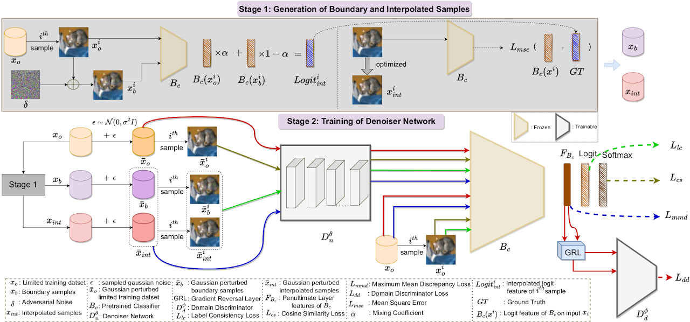

# DE-CROP: Data-efficient Certified Robustness for Pretrained Classifiers (WACV 2023) - Official Implementation

Paper Link: https://arxiv.org/pdf/2210.08929.pdf

Project Webpage: https://sites.google.com/view/decrop

<hr>

### Method Overview



<hr>

### Training & Evaluation

1. Pre-train denoiser using $L_{lc}$, $L_{cs}$, $L_{mmd}$ losses: ```pretrain_denoiser_decrop.sh```
2. Train denoiser with additional $L_{dd}$ loss along with Gradient Reversal Layer (initialized using pre-trained weights in 1.):  ```train_denoiser_decrop.sh```
3. Certify denoiser: ```certify_denoiser_decrop.sh```
4. Visualize Results: ```python code/graph_decrop.py```


<hr>

### Citation

If you use this code, please cite our work as:

    @inproceedings{
        nayak2023_DECROP,
        title={DE-CROP: Data-efficient Certified Robustness for Pretrained Classifiers},
        author={Nayak, G. K., Rawal, R., and Chakraborty, A.},
        booktitle={IEEE Winter Conference on Applications of 
        Computer Vision},
        year={2023}
    }

<hr>


### Acknowledgements

This repo is adapted from [Salman et al. 2020](https://arxiv.org/abs/2003.01908) and utilizes utility functions from [torchattacks](https://github.com/Harry24k/adversarial-attacks-pytorch) library for generating boundary and interpolated samples.